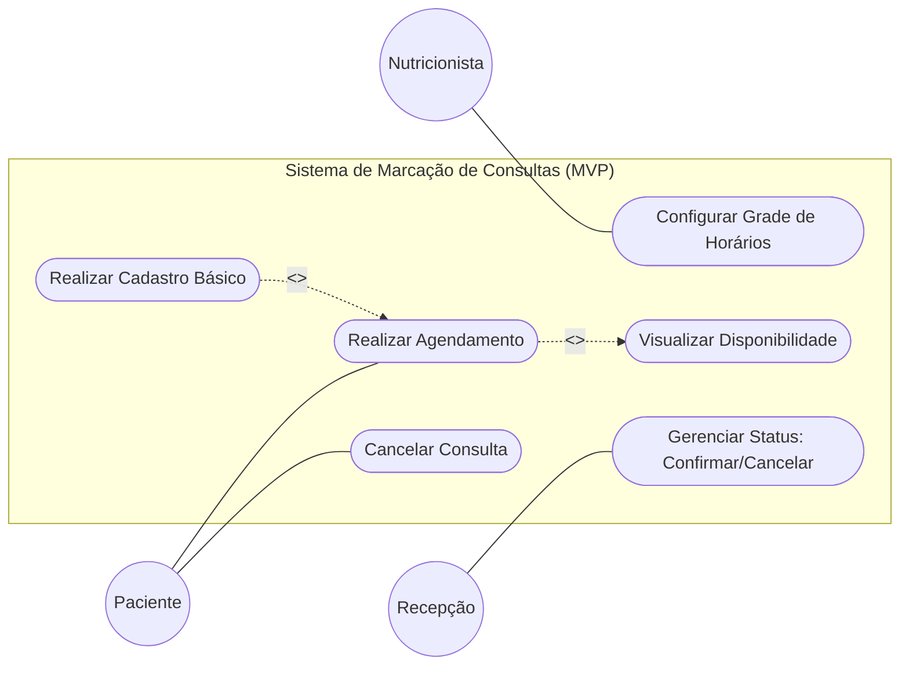

# NutriPI

Plataforma web de marcação de consultas para consultórios de nutrição, com foco em **agendamento direto pelo paciente**, **organização da grade do nutricionista** e **redução de faltas (absenteísmo)** por meio de fluxo digital integrado.

---

## 1. Visão Geral do Produto

O **NutriPI** nasce para substituir processos manuais de agendamento por uma experiência digital simples e centralizada, conectando:

- **Nutricionista**, que configura sua disponibilidade de atendimento;
- **Paciente**, que visualiza horários e realiza reservas pela área logada;
- **Recepção**, que acompanha e gerencia o status das consultas.

No MVP, o sistema prioriza rapidez de operação, clareza no fluxo de marcação e base de dados padronizada para sustentar evoluções futuras do ecossistema.

---

## 2. Documento de Visão

### 2.1 Histórico de Revisão

| Data       | Versão | Descrição                         | Autores |
|------------|--------|-----------------------------------|---------|
| 04/03/2026 | 1.0    | Início do esboço do projeto       | Thiago Mendes Jatobá; Gabriel Lima; Gabriel Silva Gomes; Débora dos Santos da Silva; Marcos Paulo Santos Boe |

### 2.2 Escopo

O objetivo primordial do software é **automatizar a gestão de agendamentos em consultórios de nutrição**, eliminando tarefas manuais e combatendo faltas com notificações e controle de status.

O foco inicial está em:

- eficiência operacional interna do consultório;
- conveniência para pacientes já vinculados à clínica;
- consolidação de uma base de dados estruturada e consistente.

### 2.3 Estratégia de Evolução

A solução é concebida para escalar tecnicamente, com arquitetura preparada para:

- atender múltiplos clientes em infraestrutura compartilhada (modelo multi-cliente);
- manter isolamento operacional por consultório;
- permitir evolução modular sem refatorar o núcleo.

Módulos futuros previstos (fora do MVP):

- triagem avançada;
- faturamento hospitalar;
- ecossistema ampliado de serviços de saúde.

### 2.4 Resumo Executivo

O produto entrega uma plataforma de agendamento direto onde o consultório publica sua grade e o paciente reserva horários pela aplicação web. O processo é apoiado por lembretes automáticos e por um painel simplificado para a recepção.

---

## 3. Escopo do MVP

### Incluído no MVP

- Configuração de grade de horários do nutricionista;
- Visualização de disponibilidade para agendamento;
- Agendamento direto pelo paciente em área autenticada;
- Cadastro básico de paciente no primeiro agendamento;
- Gestão de status da consulta pela recepção (confirmar/cancelar);
- Cancelamento de consulta pelo paciente (conforme diagrama de caso de uso).

### Explicitamente fora do MVP

- Motor de busca global de profissionais;
- Gestão complexa de convênios;
- Prontuário eletrônico completo;
- Módulos financeiros.

---

## 4. Requisitos

### 4.1 Requisitos Funcionais

| Cod. | Nome                    | Descrição |
|------|-------------------------|-----------|
| F01  | Configuração de Grade   | O sistema deve permitir que o nutricionista defina dias, horários de atendimento e duração padrão das consultas. |
| F02  | Agendamento Direto      | O paciente deve conseguir visualizar horários disponíveis e realizar reserva pela área logada do site. |
| F03  | Gestão de Status        | A recepção deve poder marcar consultas como **Confirmada** ou **Cancelada**. |
| F04  | Cadastro de Pacientes   | O sistema deve permitir registro básico de dados do paciente no momento do primeiro agendamento. |

### 4.2 Requisitos Não Funcionais

| Cod. | Nome                  | Descrição |
|------|-----------------------|-----------|
| NF01 | Segurança (LGPD)      | Dados de saúde e identificação devem ser criptografados e armazenados conforme a LGPD. |
| NF02 | Disponibilidade       | O paciente pode acessar sua área logada a qualquer momento para consultar informações. |
| NF03 | Responsividade        | A interface de agendamento deve ser otimizada para dispositivos móveis (mobile-first). |
| NF04 | Interface Intuitiva   | A solução deve ser simples de consultar, fácil de usar e preparada para escalar. |

---

## 5. Diagrama de Casos de Uso (MVP)

### 5.1 Atores

- **Nutricionista**: define agenda e janelas de atendimento.
- **Paciente**: consulta disponibilidade, agenda e cancela consultas.
- **Recepção**: valida atendimento operacional confirmando ou cancelando status.

### 5.2 Relações importantes

- **Realizar Agendamento** inclui **Visualizar Disponibilidade**.
- **Realizar Cadastro Básico** estende **Realizar Agendamento** quando o paciente ainda não possui registro.

---

## 6. Personas do Sistema

### 6.1 Persona 1 — Nutricionista (Gestor de Agenda)

- **Nome representativo**: Dr. Rafael (Nutrólogo/Nutricionista)
- **Objetivo principal**: manter agenda organizada e previsível.
- **Necessidades**:
  - configurar dias e horários de atendimento com facilidade;
  - reduzir conflitos de agenda e horários vagos;
  - ter segurança de que a recepção acompanha o status das consultas.
- **Dores atuais**:
  - remarcações manuais;
  - dificuldade de consolidar agenda em canais dispersos.
- **Como o NutriPI ajuda**:
  - centraliza a grade de horários;
  - padroniza reservas em um fluxo único.

### 6.2 Persona 2 — Paciente (Usuário de Autoatendimento)

- **Nome representativo**: Ana, 29 anos
- **Objetivo principal**: marcar consulta de forma rápida e sem contato telefônico.
- **Necessidades**:
  - visualizar horários disponíveis em tempo real;
  - concluir agendamento em poucos passos;
  - acessar o sistema pelo celular com boa usabilidade;
  - cancelar consulta quando necessário.
- **Dores atuais**:
  - demora em retorno por telefone/mensagem;
  - falta de clareza sobre horários livres.
- **Como o NutriPI ajuda**:
  - oferece autoatendimento web em área autenticada;
  - melhora experiência com interface responsiva e intuitiva.

### 6.3 Persona 3 — Recepção (Operação Administrativa)

- **Nome representativo**: Carla, recepcionista
- **Objetivo principal**: manter controle diário da agenda e confirmar presença.
- **Necessidades**:
  - visualizar rapidamente consultas agendadas;
  - alterar status para **Confirmada** ou **Cancelada**;
  - reduzir erros operacionais e retrabalho.
- **Dores atuais**:
  - excesso de atualizações manuais;
  - inconsistência de informações entre canais.
- **Como o NutriPI ajuda**:
  - fornece painel administrativo com visão centralizada;
  - simplifica gestão de status em fluxo único.

---

## 7. Protótipos de Tela

Protótipos disponíveis no Figma:  
https://www.figma.com/design/WssgymwKX8ejjgaBu1Wrj6/NutriPi?node-id=0-1&p=f

---

## 8. Diretrizes de Qualidade do Produto

- **Segurança e conformidade**: tratamento de dados conforme LGPD.
- **Alta disponibilidade percebida**: acesso contínuo à área logada do paciente.
- **Mobile-first**: experiência otimizada para smartphone.
- **Usabilidade**: navegação simples e direta para reduzir atrito em operações críticas.

---

## 9. Status do Projeto

Projeto em fase de evolução incremental, com MVP centrado em agendamento e gestão de status, preparado para expansão modular em funcionalidades clínicas e operacionais futuras.
